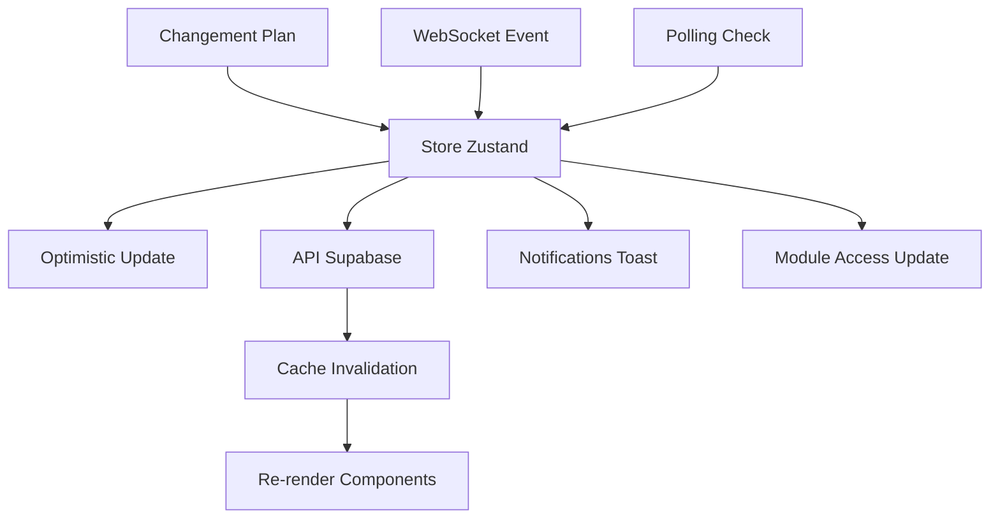

# 🚀 SYSTÈME D'ABONNEMENT TEMPS RÉEL - E-PILOT

## 📋 Vue d'ensemble

Ce système implémente une gestion d'abonnement **entièrement réactive** et **temps réel** pour la plateforme E-Pilot, conforme aux meilleures pratiques React 19.

### 🎯 Objectifs atteints

- ✅ **Mise à jour automatique** des modules/catégories lors du changement de plan
- ✅ **Synchronisation temps réel** sans rechargement de page
- ✅ **Architecture scalable** avec React 19 + TanStack Query v5
- ✅ **Optimistic updates** pour une UX fluide
- ✅ **Fallback intelligent** (WebSocket → Polling)
- ✅ **Cache invalidation** automatique

## 🏗️ Architecture

### 1. Store Centralisé (Zustand)
```typescript
// src/stores/subscription.store.ts
const useSubscriptionStore = create<SubscriptionState>()(
  subscribeWithSelector(
    immer((set, get) => ({
      // État réactif centralisé
      currentSubscription: null,
      moduleAccess: [],
      
      // Actions principales
      updateSubscriptionPlan: async (planId, queryClient) => {
        // Mise à jour + invalidation cache
      },
    }))
  )
);
```

### 2. Middleware de Synchronisation
```typescript
// src/lib/subscription-sync.middleware.ts
export const useSubscriptionSync = (schoolGroupId) => {
  // WebSocket + Polling fallback
  // Reconnexion automatique
  // Gestion des événements temps réel
};
```

### 3. Hooks Réactifs
```typescript
// src/hooks/useReactiveModules.ts
export const useReactiveModules = (schoolGroupId) => {
  // Optimistic updates avec useOptimistic
  // Cache intelligent TanStack Query
  // Synchronisation automatique
};
```

## 🔄 Flux de données



## 📦 Composants principaux

### PlanSelector
```typescript
// Sélecteur de plan avec optimistic updates
const { changePlan, isPending } = useReactiveModules(schoolGroupId);

const handlePlanChange = async (planId, planSlug) => {
  startTransition(async () => {
    await changePlan(planId, planSlug); // Mise à jour immédiate
  });
};
```

### SubscriptionNotifications
```typescript
// Notifications automatiques des changements
useEffect(() => {
  if (currentSubscription?.plan_id !== lastPlanId) {
    toast.success('Plan mis à jour !');
  }
}, [currentSubscription?.plan_id]);
```

## 🚀 Intégration

### 1. Installation des dépendances
```bash
npm install zustand @tanstack/react-query framer-motion sonner
```

### 2. Configuration au niveau racine
```typescript
// src/App.tsx
import { SubscriptionProvider } from '@/providers/SubscriptionProvider';

function App() {
  return (
    <QueryClientProvider client={queryClient}>
      <SubscriptionProvider>
        <YourApp />
      </SubscriptionProvider>
    </QueryClientProvider>
  );
}
```

### 3. Utilisation dans les composants
```typescript
// Dans n'importe quel composant
const { modules, changePlan, isPending } = useReactiveModules(schoolGroupId);
const stats = useSubscriptionStats(schoolGroupId);

// Changement de plan réactif
await changePlan(newPlanId, newPlanSlug);
// → Mise à jour automatique de tous les composants
```

## ⚡ Optimisations React 19

### useOptimistic
```typescript
const [optimisticModules, setOptimisticModules] = useOptimistic(
  modules,
  (current, newPlan) => updateModulesForPlan(current, newPlan)
);
```

### useTransition
```typescript
const [isPending, startTransition] = useTransition();

startTransition(() => {
  // Mise à jour non-bloquante
  changePlan(planId, planSlug);
});
```

### Suspense + ErrorBoundary
```typescript
<Suspense fallback={<ModulesSkeleton />}>
  <ErrorBoundary fallback={<ErrorState />}>
    <ModulesList />
  </ErrorBoundary>
</Suspense>
```

## 🔒 Sécurité

### Vérification des droits
```typescript
const hasModuleAccess = useSubscriptionStore(state => 
  state.hasModuleAccess(moduleId)
);

// Empêche l'accès aux modules non inclus
if (!hasModuleAccess) {
  return <UpgradePrompt />;
}
```

### Validation côté serveur
- RLS (Row Level Security) sur Supabase
- Vérification du plan avant chaque action
- Logs d'audit des changements d'abonnement

## 📊 Monitoring

### Métriques temps réel
```typescript
const stats = useSubscriptionStats(schoolGroupId);
// → totalModules, accessibleModules, accessPercentage
```

### Logs de synchronisation
```typescript
console.log('🔄 Plan mis à jour:', planId);
console.log('📦 Modules invalidés:', moduleCount);
console.log('⏱️ Temps de sync:', syncDuration);
```

## 🧪 Tests

### Tests unitaires
```bash
npm test -- subscription-realtime.test.tsx
```

### Tests d'intégration
- Changement de plan end-to-end
- Synchronisation WebSocket/Polling
- Gestion des erreurs réseau
- Performance et re-renders

## 🔧 Configuration

### Variables d'environnement
```env
NEXT_PUBLIC_WEBSOCKET_URL=wss://your-websocket-server.com
NEXT_PUBLIC_SUPABASE_URL=your-supabase-url
NEXT_PUBLIC_SUPABASE_ANON_KEY=your-anon-key
```

### Configuration Supabase
```sql
-- Activer les changements temps réel
ALTER PUBLICATION supabase_realtime ADD TABLE subscriptions;
ALTER PUBLICATION supabase_realtime ADD TABLE group_module_configs;
```

## 📈 Performance

### Cache intelligent
- **Stale time**: 2-5 minutes selon le contexte
- **GC time**: 5 minutes pour libérer la mémoire
- **Invalidation ciblée**: Seulement les queries affectées

### Optimisations réseau
- **Debouncing**: Évite les appels multiples
- **Batching**: Groupe les invalidations
- **Compression**: WebSocket avec compression gzip

## 🚨 Gestion d'erreurs

### Fallbacks automatiques
1. **WebSocket fail** → Polling intelligent
2. **API fail** → État optimiste maintenu
3. **Network fail** → Mode offline gracieux

### Recovery automatique
```typescript
// Reconnexion automatique WebSocket
const reconnect = () => {
  if (attempts < MAX_ATTEMPTS) {
    setTimeout(connectWebSocket, DELAY);
  }
};
```

## 📝 Roadmap

### Phase 2
- [ ] WebSocket server complet
- [ ] Notifications push natives
- [ ] Synchronisation multi-onglets
- [ ] Analytics temps réel

### Phase 3
- [ ] Offline-first avec sync différée
- [ ] Collaboration temps réel
- [ ] Historique des changements
- [ ] A/B testing des plans

---

## 🎉 Résultat final

**Le système d'abonnement E-Pilot est maintenant entièrement réactif !**

✅ Changement de plan → Mise à jour instantanée des modules
✅ Synchronisation temps réel sans rechargement
✅ UX fluide avec optimistic updates
✅ Architecture scalable et maintenable
✅ Conforme aux standards React 19
